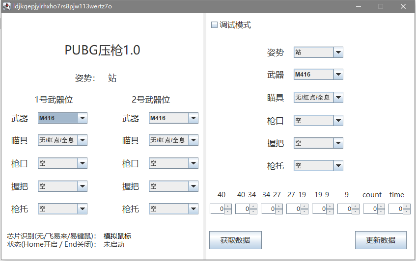

# pubg-press-gun-script

### 由于朋友都弃游了，放弃再次开发了。。。

### 2.0展望

1. UI将使用JAVAFX开发
2. 尝试做自动识别

### pubg压枪脚本界面展示

### 技术栈

1. java swing
2. java jna
3. 易键鼠芯片dll，飞易来芯片dll
4. system-hook 全局鼠标键盘监听
5. sqllite数据库

### 使用说明

1. config.setting 配置 默认识别芯片
`#芯片(0模拟鼠标1飞易来，2易键鼠)`
`chip = 2`
2. `Home`键开启，`End`键关闭
3. 勾选调试模式可对压枪数据进行调整

### 项目参考
https://github.com/cdians/youyiPUBG
